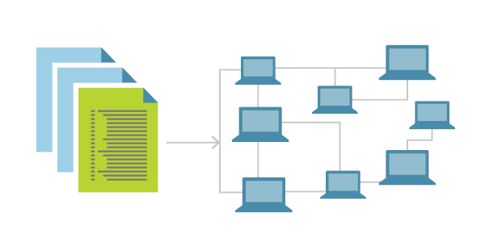
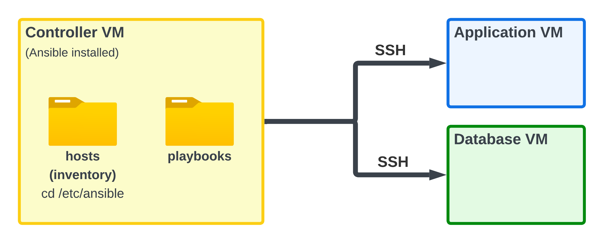

# Learning Infrustructure as Code (IaC)

- [Learning Infrustructure as Code (IaC)](#learning-infrustructure-as-code-iac)
  - [What is IaC?](#what-is-iac)
  - [Benefits of IaC?](#benefits-of-iac)
  - [When/where to use IaC?](#whenwhere-to-use-iac)
  - [What are the tools available for IaC?](#what-are-the-tools-available-for-iac)
  - [What is configuration management (CM)?](#what-is-configuration-management-cm)
  - [What is provisioning of infrastructure? Do CM tools do it?](#what-is-provisioning-of-infrastructure-do-cm-tools-do-it)
  - [What is Ansible and how does it work?](#what-is-ansible-and-how-does-it-work)
  - [Who is using IaC and Ansible in the industry?](#who-is-using-iac-and-ansible-in-the-industry)
- [Learning Ansible](#learning-ansible)
  - [Important Things to Know](#important-things-to-know)
  - [Setting up Ansible on two VMs](#setting-up-ansible-on-two-vms)
    - [Task: Work out the command to use to copy test.txt to your target node](#task-work-out-the-command-to-use-to-copy-testtxt-to-your-target-node)
    - [Task: Create playbook to provision app VM](#task-create-playbook-to-provision-app-vm)
      - [Stage 1: Create a new playbook called prov\_app\_with\_npm\_start.yml to install nodejs on the target node](#stage-1-create-a-new-playbook-called-prov_app_with_npm_startyml-to-install-nodejs-on-the-target-node)
      - [Stage 2: Make an updated version of prov\_app\_with\_npm\_start.yml named prov\_app\_with\_pm2.yml (or similar)](#stage-2-make-an-updated-version-of-prov_app_with_npm_startyml-named-prov_app_with_pm2yml-or-similar)

## What is IaC?
Infrastructure as Code (IaC) is the process of managing and provisioning computing infrastructure using machine-readable configuration files instead of manual processes.



## Benefits of IaC?

* Consistency and repeatability
* Scalability and faster deployments
* Version control for infrastructure
* Reduced manual errors
* Automated and reliable infrastructure management

## When/where to use IaC?

IaC is used in environments requiring automation, cloud deployments, CI/CD pipelines, when scaling infrastructure efficiently, when it saves time, if infrastructure is managed by multiple people and redunduncy/infrustucture versioning (security).

## What are the tools available for IaC?

* Terraform
* AWS CloudFormation
* Ansible
* Puppet
* Chef

## What is configuration management (CM)?
CM refers to the process of standardizing resource configurations to ensure consistency across systems, often automating changes and deployments.

## What is provisioning of infrastructure? Do CM tools do it?
Provisioning is the process of setting up resources such as servers, databases, and networks. Some CM tools (e.g. Ansible, Puppet) can provision infrastructure but are more commonly used for configuring it post-provisioning.

## What is Ansible and how does it work?
Ansible is an open-source automation tool for configuration management, provisioning, and application deployment. It works by connecting to nodes via SSH, executing playbooks (in YAML) that describe the desired state.

* Instructions is written in YAML --> certain tasks are defined on a playbook.
* Controller (central machine) carries out the configurations.

## Who is using IaC and Ansible in the industry?
Major companies like Netflix, Capital One, NASA, and Google use IaC and tools like Ansible for automating infrastructure management and deployments.

# Learning Ansible



## Important Things to Know

* Utilise **Playbooks** to run multiple tasks on target nodes. These playbook files use the YAML structure. It use a declarative approach meaning we declare the state and Ansible leverage the correct commands and format to achive the desired state.
* **Linux** isn't item potent meaning that if you **run and re-run scripts you don't always get the same result**.** Ansible modules** on the other hand **provide item potensy, making it best practice to utilise Ansible modules**.
* **Target nodes** do not need to be on the same **OS** as the **Controller**.
* **Ansible** does **not** need to be **installed** on **Target nodes**.

## Setting up Ansible on two VMs
 
1. Create two VMs on AWS and attaching NSG rules for the controller only enabling SSH and NSG rules for the target node enabling HTTP, SSH and port 3000.
2. When they're both created, we `update` and `upgrade` both of our VMs.
3. Go to the controller VM window and insert the command `sudo apt-add-repository ppa:ansible/ansible` to install the ansible resource, followed by `sudo apt update -y` and `sudo apt install ansible -y`.
4. Check the version for clarity.

```bash
ansible --version
```
5. Before the Controller can access the Target nodes we need to give it the SSH private key that matches the SSH public key attached to the Target nodes. So we change directories to the SSH folder within our home directory `cd ~/.ssh`
6. Create a file, recomended to be named to the original private key file name, and paste in the contents of the private key.

```bash
# Whilst within the .ssh folder
nano <ssh_key_file_name>

# Once the text editor is open paste the private key contents.
# DO THIS SECURELY DO NOT EXPOSE YOUR PRIVATE KEY
```
7. After saving and exiting the text editior we need to set Read only permissions to the SSH key. So whilst in the `.ssh` folder run the below command.

```bash
chmod 400 "<ssh_private_key_file_name>"
```

8. CD into `/etc/ansible` folder.
9.  Use `ansible all -m ping` to ping all the machines that Ansible knows to communicate with. If there are none, use `sudo nano hosts` once in the `/etc/ansible` directory to add some.
10. Add the bellow information giving telling the controller where (IP address & user) the target node is and how to access it (SSH key):
 
```bash
[web]
ec2-app-instance ansible_host=54.195.174.237 ansible_user=ubuntu ansible_ssh_private_key_file=~/.ssh/tech264-name-aws-key.pem
```
 
*Note! We can also put a `[db]` group to specify database dervers.*
 
11. To put these in a parent group, we set them up like so:
 
```bash
[test:children]
web
db (if we made the group)
```
 
This means we could ping the `test` group and get responses from all its children.
 
*⚠️ 8. This will be in the exam!*
 
**Helpful commands:**
- We can use `ansible-inventory --list` to check groups we've made. Replace `--list` with `--graph` to see it in a tree-like format.
- `ansible <group_or_machine_name> -a <command_to_be_run_in_double_quotes>` (Called an adhoc command) This format can be used to run a specific command on a particular machine, or all of them, eg:

```bash
ansible web -a "uname -a"
```
 
1.  Insert `sudo nano install_nginx.yaml` to create a yaml file (playbook).
2.  In the file, insert this:
 
```bash
# Starts with --- (three hyphens)
---
 
# Name of the play
- name: install nginx play
  # Where - on which devices - run this playbook
  hosts: web
 
  # Get comprehensive facts on the hosts / devices
  gather_facts: yes # If you want the playbook to run faster, turn this off using "no"
 
  # Do we need to provide admin access? Use sudo
  become: true
 
  # Instructions for this play, known as "tasks"
  # First Task: Install nginx on the Target Node
  tasks:
  - name: install and configure nginx
    # Use "nginx" package // "state=present" means we need it running
    apt: pkg=nginx state=present
```
 
14. We can use `ansible-playbook install_nginx.yaml` to activate the playbook. This should mean that `nginx` is installed and running.

### Task: Work out the command to use to copy test.txt to your target node

Use copy module to do it, rather than ad hoc command

```bash
ansible web -m ansible.builtin.copy -a "src=~/test.txt dest=~/test.txt"
```

### Task: Create playbook to provision app VM

#### Stage 1: Create a new playbook called prov_app_with_npm_start.yml to install nodejs on the target node

1. Navigate to playbook directory

```bash
cd /etc/ansible
```

2. Create a playbook called prov_app_with_npm_start.yml 

```bash
sudo nano prov_app_with_npm_start.yml
```

3. Add the below yaml code

```bash
---
- name: Provision NodeJS application with npm start
  hosts: web

  # Give sudo previlleges
  become: true

  # Do not get comprehensive facts on the hosts / devices (Makes it faster)
  gather_facts: no

  tasks:
    # Add NodeSource repository for Node.js 20.x
    - name: Add NodeSource repository for Node.js 20.x
      ansible.builtin.apt_key:
        url: https://deb.nodesource.com/gpgkey/nodesource.gpg.key
        state: present

    
    - name: Add NodeSource APT repository
      ansible.builtin.apt_repository:
        repo: 'deb https://deb.nodesource.com/node_20.x {{ ansible_distribution_release }} main'
        state: present

    - name: Update apt cache
      ansible.builtin.apt:
        update_cache: yes

    # Install NodeJS 20.x
    - name: Install NodeJS 20
      ansible.builtin.apt:
        name: nodejs
        state: present
      tags: install_node

    - name: Clone the app repository to the control node
      delegate_to: localhost
      ansible.builtin.git:
        repo: 'https://github.com/AdonisAlgos/tech264-sparta-app.git'
        dest: /home/ubuntu/app
        version: main
      tags: clone_app

    # Copy the 'app' folder to the target node
    - name: Copy app folder to target node
      ansible.builtin.copy:
        src: /home/ubuntu/app/
        dest: /home/ubuntu/app/
        mode: '0755'
      tags: copy_app

    # Navigate to the app folder and do npm install
    - name: Install dependencies with npm
      ansible.builtin.shell:
        cmd: npm install
        chdir: /home/ubuntu/app
      tags: npm_install

    # Navigate to the app folder and do npm start
    - name: Start the application with npm start
      ansible.builtin.shell:
        cmd: npm start
        chdir: /home/ubuntu/app
      tags: npm_start
```

#### Stage 2: Make an updated version of prov_app_with_npm_start.yml named prov_app_with_pm2.yml (or similar)

1. Navigate to playbook directory

```bash
cd /etc/ansible
```

2. Create a playbook called prov_app_with_npm_start.yml 

```bash
sudo nano prov_app_with_pm2.yml
```

3. Add the below yaml code

```bash
---
- name: Provision NodeJS application with pm2
  hosts: web
  become: true
  gather_facts: no

  tasks:
    # Add NodeSource repository for Node.js 20.x
    - name: Add NodeSource repository for Node.js 20.x
      ansible.builtin.apt_key:
        url: https://deb.nodesource.com/gpgkey/nodesource.gpg.key
        state: present

    
    - name: Add NodeSource APT repository
      ansible.builtin.apt_repository:
        repo: 'deb https://deb.nodesource.com/node_20.x {{ ansible_distribution_release }} main'
        state: present

    - name: Update apt cache
      ansible.builtin.apt:
        update_cache: yes

    # Install NodeJS 20.x
    - name: Install NodeJS 20
      ansible.builtin.apt:
        name: nodejs
        state: present
      tags: install_node

    - name: Clone the app repository to the control node
      delegate_to: localhost
      ansible.builtin.git:
        repo: 'https://github.com/AdonisAlgos/tech264-sparta-app.git'
        dest: /home/ubuntu/app
        version: main
      tags: clone_app

    # Copy the 'app' folder to the target node
    - name: Copy app folder to target node
      ansible.builtin.copy:
        src: /home/ubuntu/app/
        dest: /home/ubuntu/app/
        mode: '0755'
      tags: copy_app

    # Install dependencies with npm
    - name: Install dependencies with npm
      ansible.builtin.shell:
        cmd: npm install
        chdir: /home/ubuntu/app
      tags: npm_install

    # Install pm2 globally
    - name: Install pm2 globally
      ansible.builtin.shell:
        cmd: npm install -g pm2
      tags: install_pm2

    # Start the application with pm2
    - name: Start the application with pm2
      ansible.builtin.shell:
        cmd: pm2 start app.js --name my_app
        chdir: /home/ubuntu/app
      tags: pm2_start
```
